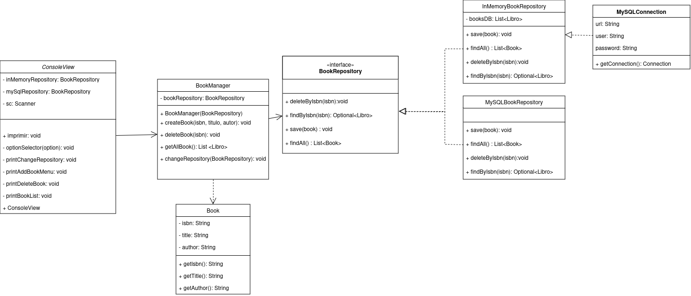

Tech Book Manger
# 📚 Tech Books Manager App
## 📄Descripción **Tech Books Manager App** es una aplicación de consola desarrollada en Java que permite a los usuarios gestionar una colección de libros técnicos de programación. La aplicación proporciona una interfaz interactiva en la consola que permite realizar varias operaciones sobre la colección, como añadir, ver, y eliminar libros.
## ✨ Características :
**🆕Añadir Libro**: Agrega un libro proporcionando título, autor e ISBN. El ISBN debe seguir el formato de una letra seguida de tres números (por ejemplo, A123). 
- **👓Ver todos los libros**: Muestra la lista completa de libros en la colección. 
- **🗑️Eliminar libro**: Permite eliminar un libro de la colección introduciendo su ISBN.
- **🔄Cambiar repositorio**: Opción para futuras implementaciones. 
- **❌Salir de la aplicación**: Cierra el programa.📚 Tech Books Manager App

## 📂Estructura del Código
- **Clase `Imprimir`**: Contiene el menú principal y la lógica de manejo de la colección de libros. Gestiona la interacción con el usuario y las operaciones en la lista de libros. 
- **Métodos clave**: 
- - `imprimir()`: Muestra el menú y controla las opciones seleccionadas. 
- - `addBook()`: Permite añadir un nuevo libro a la lista, validando ISBN único y formato. 
- - `deleteBook()`: Permite eliminar un libro de la lista usando el ISBN. 
- - `imprimirlibros()`: Muestra todos los libros en la colección o un mensaje si la lista está vacía. 

## 🛠️  Instalación 1. 
- Clona este repositorio. 

```bash git clone https://github.com/usuario/tech-books-manager-app.git```
- Navega al directorio del proyecto.

```cd tech-books-manager-app```

- Compila el código fuente.

 ```javac -d bin src/com/alexmonzon/*.java```
- Ejecuta la aplicación.

```java -cp bin com.example```

## 🚀 Uso

- Al iniciar la aplicación, selecciona una opción del menú para gestionar tu colección de libros.
- Sigue las instrucciones en la consola para añadir, ver o eliminar libros.
- Ingresa el ISBN en el formato adecuado (una letra y tres números, como A123) cuando agregues o elimines un libro.
  🖥️ Ejemplo de Ejecución
  plaintext
  Copiar código
  Bienvenido a Tech Books Manager App
  Seleccione una opción:
1. 🆕 Añadir libro
2. 👓 Ver todos los libros
3. 🗑️ Eliminar libro
4. 🔄 Cambiar repositorio
5. ❌ Salir

Opción: 1
Ingrese el título del libro: Programación en Java
Ingrese el autor del libro: Alex Monzon
Ingrese el ISBN (formato: A123): B456

## 📚 Libro añadido exitosamente.

Opción: 2
Lista de libros:
- Título: Programación en Java, Autor: Alex Monzon, ISBN: B456

Opción: 3
Ingrese el ISBN del libro a eliminar: B456
🗑️ Libro eliminado exitosamente.

## 🧪 Pruebas Utilizadas
Este proyecto utiliza JUnit 5 para pruebas unitarias. Algunas pruebas clave incluyen:

Añadir un libro:

Valida que un libro se agrega correctamente a la colección.
Asegura que no se permiten duplicados en el ISBN.
Eliminar un libro:

Comprueba que un libro se elimina correctamente al proporcionar un ISBN válido.
Verifica que no se afecten otros libros en la colección.
Listar libros:

Garantiza que se muestran todos los libros en la colección.
Valida que la aplicación maneje correctamente una colección vacía.
Ejecución de pruebas:
Navega al directorio raíz del proyecto.
Ejecuta las pruebas con:
bash
Copiar código
mvn test
## 📦 Dependencias y Aplicaciones Usadas
Este proyecto utiliza las siguientes tecnologías:

## Dependencias:
Java: Lenguaje principal de desarrollo.
Maven: Gestión de dependencias y construcción del proyecto.
JUnit 5: Framework para pruebas unitarias.

## Bibliotecas:
MySQL Connector: mysql-connector-java (versión 8.0.33) para conectarse a bases de datos MySQL.

## Aplicaciones usadas:
IntelliJ IDEA: IDE para el desarrollo del código.
MySQL Workbench: Gestión y visualización de la base de datos.


## 📊 Diagrama de Clases UML
A continuación se muestra un diagrama de clases básico para la aplicación:


Copiar código
@startuml
class Imprimir {
+ imprimir(): void
+ addBook(): void
+ deleteBook(): void
+ imprimirlibros(): void
  }

class Book {
- isbn: String
- title: String
- author: String
+ Book(isbn: String, title: String, author: String)
+ getIsbn(): String
+ getTitle(): String
+ getAuthor(): String
  }

Imprimir --> Book


📌 Repositorio de Código
El código de esta aplicación está disponible en este repositorio de GitHub. Aquí puedes explorar los archivos fuente y ver cómo se implementa cada funcionalidad descrita.


## 🤝 Colaboradores

Agradecimientos especiales a los siguientes colaboradores por sus contribuciones al proyecto:


- [Evymari](https://github.com/evymari)
- [IvanLopez](https://github.com/IvanLopez-Source)
- [LayGomez](https://github.com/LayGomez)
- [Alex]()

## 🔗 Recursos del Proyecto

### 📋 Jira
Puedes acceder al tablero de Jira para ver el progreso del proyecto y el estado de las tareas en el siguiente enlace:
- [Jira Board - Proyecto ILAE](https://doingtechthings.atlassian.net/jira/software/projects/ILAE/boards/2)

### 📝 Diagramas en Draw.io

Para ver y editar los diagramas del proyecto, utiliza el siguiente enlace a Draw.io:

- [Draw.io - Diagramas del Proyecto](https://drive.google.com/file/d/1uBBDb_S9NP8q_nvbcwhBTsAeaM8q8FOD/view?usp=sharing )

